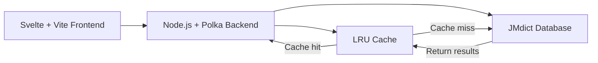

# Akihi

[Akihi](https://akihi.vercel.app/) is a lightweight Japanese–English dictionary web app inspired by [Jisho.org](https://jisho.org).  
It uses [JMdict](https://www.edrdg.org/jmdict/j_jmdict.html), an open-source lexical database, and supports fast lookups for both Japanese and English words.

## Features

- Instant search for Japanese or English words  
- Cached search results for faster performance  
- API-powered backend built with [Polka](https://github.com/lukeed/polka)  
- Frontend built with Svelte + Vite  
- Uses JMdict-simplified for accurate dictionary data  

## Tech Stack

| Layer | Technology |
|-------|-------------|
| Frontend | Svelte + Vite |
| Backend | Node.js + Polka |
| Data | JMdict-simplified |

## Performance & Significance

To ensure fast and responsive search queries, Akihi leverages an **LRU (Least Recently Used) cache** on the backend for English word searches.  

- **Why LRU cache?**  
  English searches require filtering the full JMdict dataset, which can be large. Without caching, repeated queries would be slow and resource-intensive.  

- **How it works:**  
  - The first search for a query scans the dictionary and stores the results in the LRU cache.  
  - Subsequent searches for the same query retrieve results directly from the cache, avoiding repeated expensive operations.  
  - The cache automatically removes the least recently used entries when it reaches a set size limit, keeping memory usage efficient.  
  

This strategy significantly improves **performance**, reduces server load, and provides near-instant search results for frequently queried terms.

## License

This project is licensed under the MIT License.
